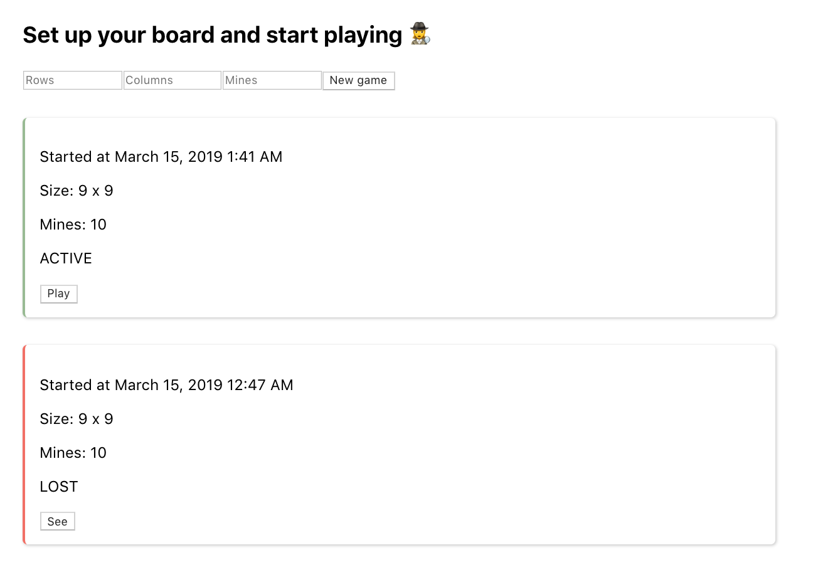

# Minesweeper Frontend

Lives at https://minesweeperfrontend.herokuapp.com/

## First steps
- Make sure you have Node and npm installed and just run: `npm install`
- To start the server run `npm start`

## Client
- In the client folder you'll find the Minesweeper client, which consists of a bunch of methods.
- Each of those methods returns a promise to be resolved with the data of the response to the request.
- It uses [axios](https://github.com/axios/axios) to make http requests.

## Components
- Most important component is the `Game` one.
- It fetches the game and render the cells. The cells are distributed using the grid display from css.

## Session
- The user uuid is stored in the local storage after the user is created at sign up.
- If logout is clicked, then the uuid will be removed from the local storage.
- Login feature (with an existing user) TODO

## How to play
- https://www.instructables.com/id/How-to-play-minesweeper/
- To put a flag into an square we need to push **Ctrl** before clicking
